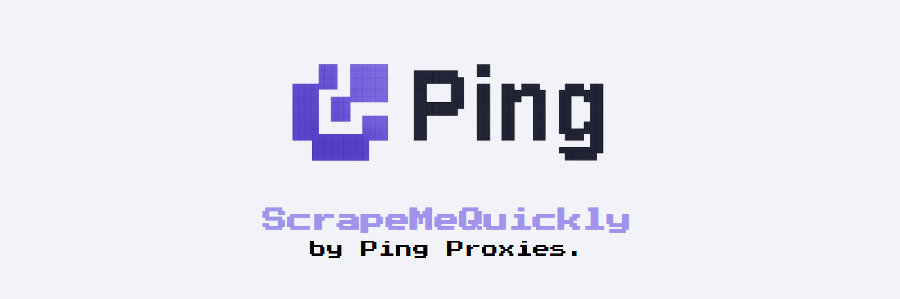

# Scrape Me Quickly



Welcome to the [Scrape Me Quickly](https://scrapemequickly.com) hackathon challenge by [Ping Proxies](https://pingproxies.com).

## Overview

The goal is to build a system which can scrape all 100,000 car listings on the ScrapeMeQuickly website, analyze the results, and submit your answers as quickly as possible.

## What You'll Learn

This challenge will test your problem-solving skills and curiosity! You'll learn fundamental web-scraping techniques and:

- Face roadblocks like bans or rate-limits that you'll need to overcome with solutions like proxies
- Investigate the website and build a system which can scrape data optimally, testing code quality, concurrency handling, and implementing retry mechanisms
- Get a good introduction to web data collection and data analysis - increasingly important and widely used skills across many industries including:
  - Finance (market analysis, competitor pricing)
  - E-commerce (product monitoring, dynamic pricing)
  - Real estate (property listings, market trends)
  - Research (data collection for academic studies)
  - Marketing (consumer insights, social media analysis)

## How It Works

You'll create a team, and then your team can create a scraping run - that's when the timer begins! Your system must scrape all the data, analyze it, and submit it as quickly as possible to our results endpoint. 

Your team's fastest score will be shown on the public leaderboard along with your number of attempts. You can constantly iterate and improve your system, trying for new faster runs until the close of the challenge on Sunday at 15:30PM.

Some Ping team members have tried to build their optimal systems, and their scores are shown on a separate leaderboard on the website.

We've left descriptive errors throughout the website to give some clues, and if you run into any major issues, we'll be available at our booth to help.

## Prizes

1st Team: 4 x Keychron K8 Keyboards  
2nd Team: 4 x £20 Amazon Vouchers  
3rd Team: 4 x £15 Uber Eats Vouchers  

## Instructions

1. Register team at [Scrape Me Quickly](https://scrapemequickly.com) using one of your UoM email addresses and an appropriate name
2. Familiarize yourself with the instructions
3. Investigate the website
4. Collect your proxies
5. Build your first system
6. Register a scraping run
7. Scrape all the 100K car listings, analyze the results, submit your answers to register your first run time
8. Iterate your system, improve your run times, and win a prize...hopefully!

## Rules

1. Use an appropriate team name
2. The web-scraping code and request execution should happen within your system and codebase i.e you can't use a paid web-scraping service or API

## Good Web Scraping Education Resources

- [Beautiful Soup Documentation](https://www.crummy.com/software/BeautifulSoup/bs4/doc/) - Python library for pulling data out of HTML and XML files
- [MDN Web Docs: Introduction to the DOM](https://developer.mozilla.org/en-US/docs/Web/API/Document_Object_Model/Introduction) - Understanding HTML document structure
- [Requests Library Documentation](https://requests.readthedocs.io/en/latest/) - Simple HTTP library for Python
- [10 Essential Scraping Tools for Developers](https://pingproxies.com/blog/scraping-tools-for-developers) - Comprehensive look at tools which web-scraping developers find useful
- [ScrapingBee Web-Scraping Guide](https://www.scrapingbee.com/blog/web-scraping-101-with-python/) - Web-scraping 101

## Important Note

For any page that you are collecting data from, it is important that you **Attach your Scraping Run ID** in the query string as shown below:

`?scraping_run_id={scraping-run-id}`

You must submit: **minimum year**, **maximum year**, **average price** and **mode (most common) make**.

**Important note:** To stop the cheaters, data is seeded uniquely for each scraping run, meaning you'll get different car data each time you create a new run. 

### Requirements
```python
import requests
import sys
import json
```

### [Create a team](https://scrapemequickly.com/team)
```python
def create_team(team_name: str, team_email: str) -> str:
    r = requests.post(
        "https://api.scrapemequickly.com/register",
        data=json.dumps({"team_name": team_name, "team_email": team_email}),
        headers={"Content-Type": "application/json"}
    )

    if r.status_code != 200:
        print(r.json())
        print("Failed to create a team")
        sys.exit(1)

    return r.json()["data"]["team_id"]
```

### [Start a scraping run](https://scrapemequickly.com/start)
```python
def start_scraping_run(team_id: str) -> str:
    r = requests.post(f"https://api.scrapemequickly.com/scraping-run?team_id={team_id}")

    if r.status_code != 200:
        print(r.json())
        print("Failed to start scraping run")
        sys.exit(1)

    return r.json()["data"]["scraping_run_id"]
```

### [Submit your answers](https://scrapemequickly.com/submit)
```python
def submit(answers: dict, scraping_run_id: str) -> bool:
    r = requests.post(
        f"https://api.scrapemequickly.com/cars/solve?scraping_run_id={scraping_run_id}",
        data=json.dumps(answers),
        headers={"Content-Type": "application/json"}
    )

    if r.status_code != 200:
        print(r.json())
        print("Failed to submit answers")
        return False

    return True
```

### Example Submission
Scraping run id: 89d5dca4-0a34-11f0-b686-4a33b21d14f6
```json
{
    "min_year": 1934,
    "max_year": 2024,
    "avg_price": 24148,
    "mode_make": "volkswagen"
}
```

## FAQ's

- **When do submissions close?**  
  Submissions close at 3:30PM UK on Sunday April 6th 2025.

- **Need some help?**  
  Pop by our booth or @ us in the main Discord channel. We'll be available all Hackathon to answer questions but bare in mind, it's meant to be a challenge and we can't give everything away😉

- **What is a Team ID?**  
  A Team ID is the ID we have generated for your team [here](https://scrapemequickly.com/team).

- **What is a Scraping Run?**  
  A scraping run is a 'time trial' of your scraping, started at time of creation and ended when the answer has been submitted. A Team ID is required to start a new scraping run.

- **What is a Scraping Run ID?**  
  A scraping run ID is the ID that we have generated for a scraping run [here](https://scrapemequickly.com/start).

- **Why can I not submit another answer for my current scraping run?**  
  Only one answer submission can be made per scraping run, you must [create a new one](https://scrapemequickly.com/start) to try again.

- **How come I have submitted the correct answer but it was rejected?**  
  Please ensure your results are sent in the [requested format](#example-submission). If you are still unsure, visit us at the event.

- **I am being rate-limited, what do I do?**  
  Use the list of proxies provided to help with this.

- **What languages can I use?**  
  Any programming language can be used as long as the answers are submitted to the [API endpoint](#submit-your-answers) correctly.

- **Can I have a job?**  
  We are currently hiring! Visit https://careers.pingproxies.com/jobs for more info.

- **Want to try web-scraping in your spare time?**  
  Fill out [our form](https://event.activation.free-proxies.pingproxies.com) to get $50 free Ping Proxies credit to continue your web scraping journey after the hackathon!